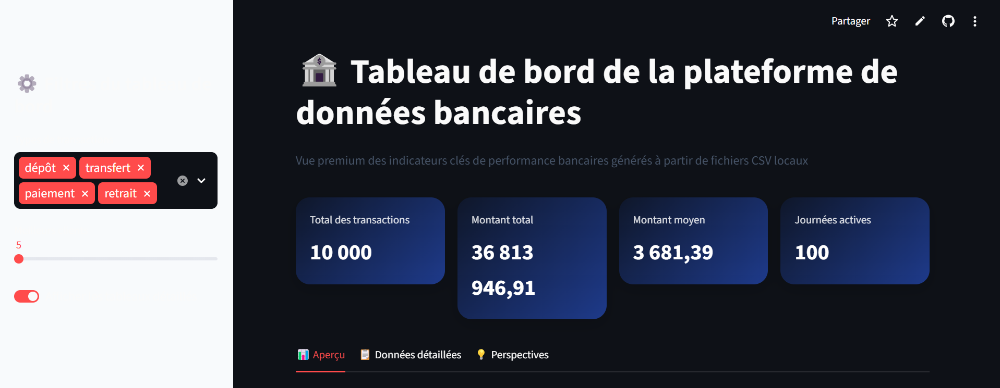

# 🏦 Bank Data Platform Dashboard

## Live Demo
[Voir le dashboard en ligne](https://3fwg7htjrwvzcpnwsvabsx.streamlit.app/)

An interactive banking KPI dashboard built with **Streamlit**, powered by **CSV data generated from a local data pipeline**.

This project showcases a simple but professional analytics workflow:
- data generation and processing
- KPI extraction
- dashboard visualization
- online deployment with Streamlit

---

## 🚀 Project Overview

The **Bank Data Platform Dashboard** is a data visualization project designed to monitor key banking indicators through a clean and interactive interface.

The dashboard displays:
- transaction volumes by type
- daily transaction trends
- top customers by total amount
- summary KPI cards
- interactive filters and detailed tables

This project was initially designed as a broader banking data platform architecture including:
- **PostgreSQL** for storage
- **FastAPI** for KPI exposure
- **Airflow** for orchestration
- **Docker** for local environment management
- **Streamlit** for dashboarding

For the deployed demo version, the dashboard reads from **local CSV files** generated from the pipeline, making the application lightweight, stable, and easy to share online.

---

## ✨ Features

- Premium Streamlit dashboard layout
- KPI summary cards
- Transaction type filtering
- Daily amount evolution chart
- Top customer analysis
- Expandable detailed data tables
- Online deployment-ready version
- Clean and readable banking analytics demo

---

## 🛠️ Tech Stack

- **Python**
- **Streamlit**
- **Pandas**
- **PostgreSQL**
- **FastAPI**
- **Apache Airflow**
- **Docker**
- **Git & GitHub**

---

## 📂 Project Structure

```bash
bank-data-platform/
│
├── airflow/                # Airflow DAGs and orchestration files
├── api/                    # FastAPI backend
├── dashboard/              # Streamlit dashboard
│   ├── app.py              # Main Streamlit application
│   └── data/               # CSV files used by the deployed demo
├── data/                   # Raw/generated source data
├── ingestion/              # Data ingestion scripts
├── sql/                    # SQL scripts and views
├── docker-compose.yml      # Local services orchestration
├── export_kpi.py           # Script to generate dashboard CSV files
├── requirements.txt        # Streamlit dependencies
└── README.md
```

## Auteur

**Dechambrun Gohirie**

## Capture du dashboard

<p align="center">
  
</p>
